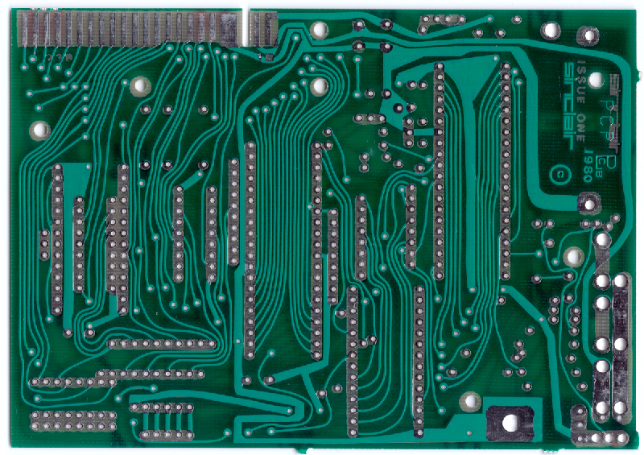
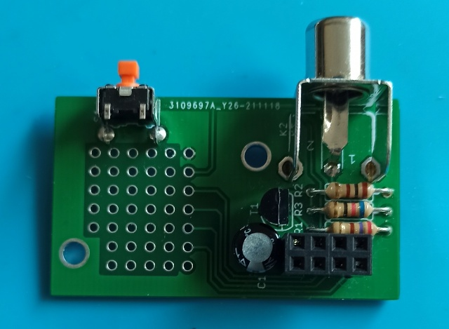

# ZX81-PCB

Recreation of the original ZX81 Issue1 PCB with rounded traces, and the WespiNano, a tiny version of the Wespi.

## DISCLAIMER:

This is for personal use only. You may not sell this design without contacting me.

## Description:

The Sinclair ZX81 was one of the first home computers. There are several PCB versions out there, but the film for the first version was created 
manually with clear foil and stickers and pen. This first version (Issue One) is rare but it is "the original" with non CAD like rounded traces.

One day some people from the German Sinclair [ZX81 forum](https://forum.tlienhard.com) diskussed how this PCB can be recreated.
So I took a photo from front and back side of the PCB with a scanner, put this as a background images in my CAD application and redraw all the traces. 
The resulting DXF file was then imported into EAGLE and than mapped to an EAGLE schematic, so I get a consistent EAGLE project. After some fine tuning 
I got a PCB design which was nearly like the original.

After some diskussions we decided to create a slightly altered version with some "modern" features. See the following chapter ...

## Versions:

### Issue 1:

This is the most authentic version. Nearly like the original with nothing changed at all:

- modulator
- old EPROM
- single resistors instead of SIL arrays

### Issue 1a:

Like Issue 1 above, but a slightly improved silkscreen. Some single resistors are replaced with SIL arrays, but no changes to the PCB traces, 
besides some cosmetic corrections

### Issue 1b:

Some functional addons:

- added connector for a small VideoOut board "under" the modulator footprint. You can omit the modulator and place this connector to add the 
  videoOut board to get an video out connector instead of the RF output. You can also add a WespNano (see below) to get WiFi, Storage and VGA.
- added footprint for a "modern" EPROM with two jumpers to select the page you like.
- added "Fast Wait" logic with a disable jumper
- added a jumper for vLA81 support. This routes the OSC pin of the ULA to A13 of the RAM, so you can use ...
- modern CMOS RAM up to 32 kB, supported by the vLA81

### Issue 1c:

- added an reset button
- added a second mounting hole for the VideoOut board for better stability.

## Addons

### VideoOut

A small addon board fitting onto Issue 1b and higher that features a buffered composite video out cinch connector

### Wespi-Nano

This is a tiny version of the Wespi project from the [ZX81 forum](https://forum.tlienhard.com). It uses an esp32 to scan the video signal to create 
a VGA or TFT video signal. Also it can send files to the ZX's tape input using a fastload mechanism. The files came from the esp's onboard flash memory 
which can be populated using a web interface from your PC or mobile. Loading is initiated by an onscreen menu on the ZX81 screen via load command.

## Hints:
In every subdirectory you find a *_Gerbers.zip. This are the files you need to create the PCB by any PCB manufacturer like JLCPCB.
In the doc directory are some photos and a nice German manual.
